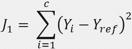
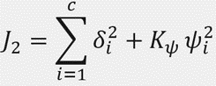
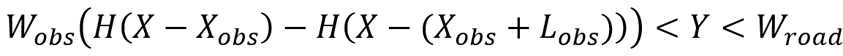

# MPC Collision Avoidance

Using Model Predictive Control to initiate a lane-change maneuver to facilitate obstacle avoidance  

Beginning with simple reference tracking maneuver

Transitioning to robust model able to operate in a wide range of initial conditions

