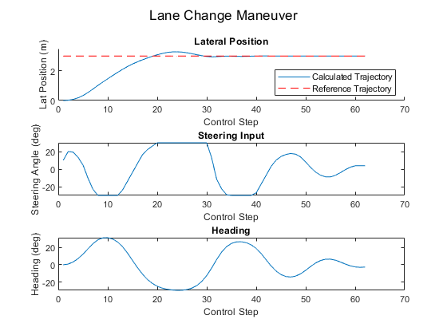
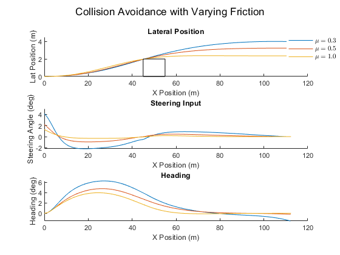
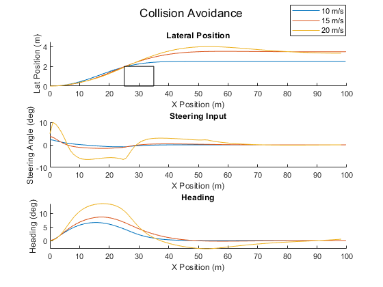

# MPC Collision Avoidance

## Using Model Predictive Control to initiate a lane-change maneuver to facilitate obstacle avoidance  

### Beginning with simple reference tracking maneuver 


### Transitioning to robust model able to operate in a wide range of initial conditions




\
\
Using the interface in `src/`

```matlab
% Setup vehicle model
car = Car();
car.wt = 1.0;

% Setup environment with obstacle(s)
env = Env();
obs_x = 50;
obs_width = 6;
obs_length = 10;
env.obstacles = Obstacle(obs_x, obs_width, obs_length, true);

% Setup MPC controller
T = 50; % sim time (s)
Ts = 0.1; % Sample Time (s)
ctrl = Controller(car, env, T, Ts);

% Initial conditions
x0 = [0,20,0,0,0,0];
u0 = 0;

% get optimal path info and plot results
info = ctrl.move(x0,u0);
ctrl.plot(info)
```


Inspired by:
Gray, Andrew, et al. “Semi-Autonomous Vehicle Control for Road Departure and Obstacle Avoidance.”
